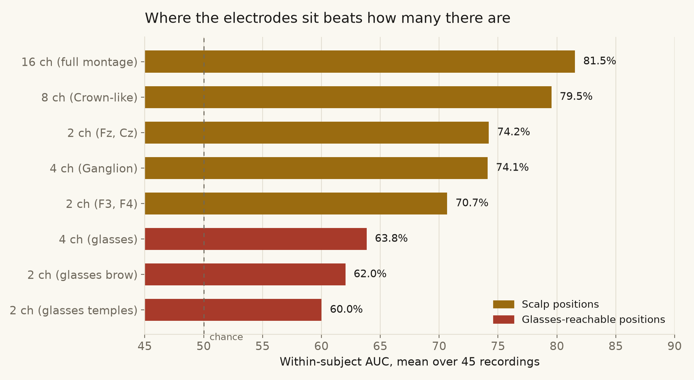
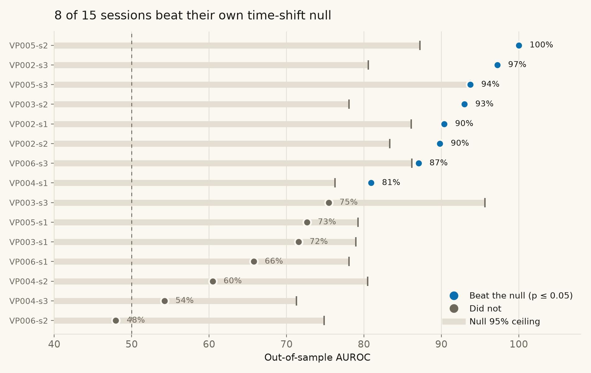
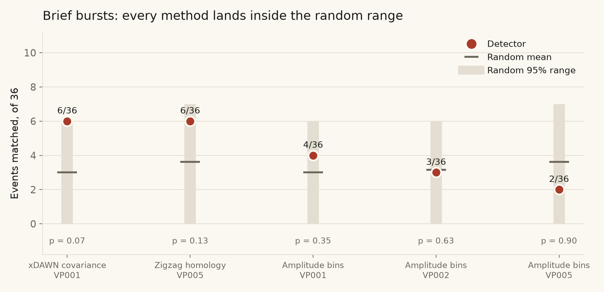

# MemoryPalace: the evidence, in one place

Everything a judge might want to check, with the numbers and the figures that produce
them. Every value here is recomputed from committed artifacts, not copied from prose.

**What MemoryPalace actually detects.** The product triggers on a **sustained deviation
from your own baseline**, not on an instantaneous spike. That wording is deliberate and
the reason for it is section 3: we tried to detect brief evoked bursts, we built a null
that could have told us we were wrong, and it did. Sustained states survived the
analysis. Instantaneous spikes did not.

Three separate questions, three separate datasets, kept apart on purpose:

| Section | Question | Dataset |
|---|---|---|
| [1. Electrodes](#1-how-many-electrodes-and-where) | How few electrodes can detect a surprise event, and where must they sit? | OpenNeuro ds006394, 33 participants |
| [2. Sustained state](#2-sustained-state-change-what-the-product-triggers-on) | Can we detect a sustained cognitive state change out of sample? | Shin 2018 dataset A, 5 participants |
| [3. Brief bursts](#3-brief-bursts-the-result-that-changed-the-product) | Can we detect brief evoked events? | Shin 2018 dataset A, 4 participants |

---

## 1. How many electrodes, and where?

**Task:** surprise versus dummy-surprise, the authors' own labels, within-subject
calibrated. [OpenNeuro ds006394](https://openneuro.org/datasets/ds006394), 16-channel
OpenBCI at 125 Hz, CC0. Method in [`confusion-detector/CHANNELS.md`](../confusion-detector/CHANNELS.md).

**Inclusion:** 51 recordings pass preprocessing. The 45 reported here are those where the
**full 16-channel montage reached AUC ≥ 0.60**, meaning there was a usable signal to grade
a montage against in the first place. That gate is applied once, on the reference montage,
and then every montage below is scored on those same 45 recordings, so the comparison is
matched. The 6 excluded recordings are named with their scores in
[`figures/inclusion.json`](figures/inclusion.json) rather than dropped silently; all 6
scored below 0.60 on the full montage, the worst at 0.34.



| Montage | n | Mean AUC | Median | Best 10 | ≥ 70% |
|---|---:|---:|---:|---:|---:|
| **16 ch, full montage** | 45 | **81.5%** | 82.2% | **94.5%** | 84.4% |
| **8 ch, Crown-like** (F3 F4 C3 C4 P3 P4 O1 O2) | 45 | **79.5%** | 79.8% | **92.4%** | 80.0% |
| 2 ch (Fz, Cz) | 45 | 74.2% | 74.6% | 92.8% | 66.7% |
| 4 ch, Ganglion (Fz Cz F7 F8) | 45 | 74.1% | 72.4% | 91.2% | 64.4% |
| 2 ch (F3, F4) | 45 | 70.7% | 71.5% | 87.2% | 55.6% |
| 4 ch, glasses (Fp1 Fp2 F7 F8) | 45 | 63.8% | 64.4% | 77.7% | 28.9% |
| 2 ch, glasses brow (Fp1 Fp2) | 45 | 62.0% | 62.9% | 76.8% | 26.7% |
| 2 ch, glasses temples (F7 F8) | 45 | 60.0% | 62.2% | 75.0% | 22.2% |

### The finding

**Halving the electrodes costs 2.0 points. Moving them to the temples costs 21.5.**

Going 16 → 8 drops mean AUC from 81.5% to 79.5%. Going from 8 scalp electrodes to 2 at
glasses temples drops it to 60.0%, barely above the 50% chance line.

Two channels at `Fz, Cz` (74.2%) beat four channels at Ganglion positions (74.1%) and
comfortably beat four at glasses positions (63.8%). Ranking all 120 electrode pairs,
**every one of the top 12 contains Cz or Fz**, the best glasses-reachable pair ranks 90th,
and the two obvious glasses pairs rank 118th and 119th of 120.

This is why MemoryPalace puts sensing on a headset and capture on the glasses. The
information is not present at glasses positions, and no amount of per-user calibration
creates it: calibration bought +6.6 points at 16 channels and **nothing at all** at
glasses positions.

---

## 2. Sustained state change: what the product triggers on

**Task:** n-back working memory, task versus rest.
[Shin 2018 dataset A](https://doc.ml.tu-berlin.de/simultaneous_EEG_NIRS/), 28 EEG channels
at 200 Hz, 5 participants, 3 sessions each. Walk-forward: the first six blocks of every
session calibrate, the last three are scored, models frozen and SHA-256 hashed before any
held-out block is touched. Method in
[`eeg-state-detection/README.md`](../eeg-state-detection/README.md).



| Sessions | Mean AUROC | Mean balanced accuracy |
|---|---:|---:|
| All 15 | 78.7% | 70.6% |
| **The 8 that beat their own null at p ≤ 0.05** | **91.5%** | **80.0%** |
| Best participant (VP002, 3 sessions) | 92.5% | 81.5% |

| Participant | Mean AUROC | Sessions at p ≤ 0.05 | Sessions |
|---|---:|---:|---|
| VP002 | 92.5% | 3/3 | 90.4, 89.8, 97.2 |
| VP005 | 88.8% | 2/3 | 72.6, 100.0, 93.8 |
| VP003 | 80.0% | 1/3 | 71.6, 93.0, 75.4 |
| VP006 | 66.9% | 1/3 | 65.8, 48.0, 87.1 |
| VP004 | 65.2% | 1/3 | 80.9, 60.5, 54.3 |

### How a session qualifies

Not by a score cutoff. Each session's out-of-sample score trace is **circularly shifted
against its labels 2000 times**. Every shift produces a fake AUROC, and those form that
session's null. A session qualifies only when fewer than 5% of shifts match or beat the
real result.

Shifting rather than shuffling is the point: EEG windows overlap, so shuffling would
destroy the autocorrelation and hand back fake significance. The grey bars in the figure
are each session's null ceiling, and they are **high**, because a task block covers most of
an excerpt. We report that width instead of quietly using a test that would have
flattered us.

The figure shows why a flat threshold would be wrong. **VP003-s3 scores 75% and fails**,
because random alignments of its own trace reach 96%. **VP004-s1 scores 81% and passes**,
because its null only reaches 76%. Each session is graded against how easy that session
actually was.

**AUROC is not accuracy.** It is the probability the model ranks a random task window
above a random rest window, so 78.7% means it orders that pair correctly 78.7% of the
time, against 50% for a coin flip. Balanced accuracy is the comparable "how often is it
right" number, and it is printed beside every AUROC here.

---

## 3. Brief bursts: the result that changed the product

**Task:** detecting brief evoked events, same corpus, 4 participants, 5 methods.



| Detector | Participant | Matched | Random mean [95%] | p |
|---|---|---:|---:|---:|
| xDAWN covariance | VP001 | 6/36 | 3.00 [0, 6] | 0.07 |
| Zigzag persistent homology | VP005 | 6/36 | 3.63 [1, 7] | 0.13 |
| Mean-amplitude bins | VP001 | 4/36 | 3.00 [0, 6] | 0.35 |
| Mean-amplitude bins | VP002 | 3/36 | 3.15 [0, 6] | 0.63 |
| Mean-amplitude bins | VP005 | 2/36 | 3.63 [1, 7] | 0.90 |

Flags were thrown at random on the same valid grid, under the same budget of five per
block, the same 1.5 s separation and the same ±0.5 s matching tolerance the detector had
to obey. Chance is not zero: five random flags match about 3 of 36 events by themselves.

**Nothing beat random.** The zigzag row is the one to look at. Six matches against a
baseline of two reads as a threefold improvement, and it sits inside the range of randomly
thrown darts. **Without the null we would have shipped it as a result.**

We also pre-registered a fix. When we suspected the detector failed because it never saw
background windows in training, we wrote the change *and its adoption rule* into
[`background_negatives_protocol.md`](../eeg-state-detection/background_negatives_protocol.md),
froze it, and ran it once on VP006, a participant no analysis had touched. It moved 0 of 36
to 2 of 36, p = 0.83. The prespecified rule failed, so **nothing was adopted**. The
protocol, the run and the refusal are all committed.

**This is why MemoryPalace captures forward on a persistence filter.** The product's
design follows the evidence rather than the ambition.

---

## What these numbers are not

- The Shin label is **task versus rest**, a proxy for a cognitive state change. Not
  confusion, not insight, not emotion, and the product never calls it that.
- The ds006394 label is **the authors' own surprise annotation**, not our own recoding.
- On VP002 and VP003 the **eye-only control** reaches 0.88 and 0.85, so ocular
  contribution is not isolated on those two participants.
- **Two of five participants are weak**: VP004 averages 65.2%, VP006 66.9%. On VP006 the
  detector wrongly includes 28 of 72 seconds of labeled rest.
- **Weights are session-specific** and transfer to nobody. That is not a caveat bolted on
  at the end, it is the technical reason the product is built around per-user adaptation
  instead of one frozen model for everyone.
- **No validated human detection in the live demo.** Every end-to-end run of the capture
  pipeline used synthetic EEG. These results establish that the signal is real in public
  data; they do not claim the demo detected anything in the wearer.

## Reproducing

```bash
# Electrodes
confusion-detector/.venv/bin/python confusion-detector/src/fetch_ds006394.py
confusion-detector/.venv/bin/python confusion-detector/src/surprise_channels.py

# Sustained state and bursts
cd eeg-state-detection
.venv/bin/python scripts/fetch_shin.py --subject 2 --out data/shin2018/VP002
.venv/bin/python -m eeg_moments backtest --out outputs/backtest_state_reproduction
```

Figures in `figures/` are regenerated by `scripts/make_final_figures.py` from those same
committed outputs.
