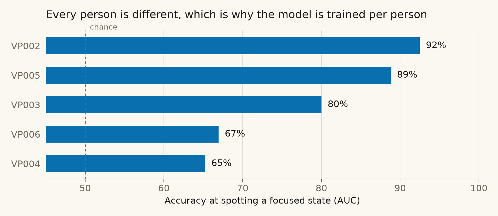

# MemoryPalace: the evidence

Two questions, two public datasets, the numbers behind the pitch.
Live version in the app under **Debug → Stats**.

**What we detect:** a sustained deviation from your own baseline. Not an instantaneous
spike. We tried brief spikes, built a null that could have proved us wrong, and it did.
That is why the product uses a persistence filter.

---

## 1. How many electrodes, and where?

Spotting a surprise. [OpenNeuro ds006394](https://openneuro.org/datasets/ds006394),
16-channel OpenBCI, the authors' own labels, calibrated per person.
n = 38 recordings, those where the full montage cleared 0.70 AUC.
The 13 excluded are named in [`figures/inclusion.json`](figures/inclusion.json).

| Electrodes | Where             |      Mean AUC | Best 10 |
| ---------- | ----------------- | ------------: | ------: |
| 16         | Full scalp        | **84%** |     95% |
| 8          | Scalp, Crown-like | **82%** |     92% |
| 2          | Fz, Cz            |           76% |     93% |
| 4          | Fz Cz F7 F8       |           76% |     91% |
| 2          | F3, F4            |           73% |     87% |
| 4          | On glasses        |           65% |     78% |
| 2          | Glasses brow      |           63% |     77% |
| 2          | Glasses temples   |           61% |     75% |

**Halving the electrodes costs 2 points. Moving them to the temples costs 21.**

Two electrodes at Fz and Cz beat four on glasses. Of all 120 possible pairs, every one of
the top 12 contains Cz or Fz, and the best glasses-reachable pair ranks 90th. Calibration
adds 7 points at 16 electrodes and nothing at all on glasses.

That is why MemoryPalace senses on a headset and captures on the glasses.

---

## 2. Does it work across people?

Spotting a sustained focused state.
[Shin 2018](https://doc.ml.tu-berlin.de/simultaneous_EEG_NIRS/), 28 channels,
5 participants, 3 sessions each. Calibrate on the first six blocks, score the last three,
models frozen before scoring.

| Participant |      Mean AUC | Sessions beating their null |
| ----------- | ------------: | --------------------------: |
| VP002       | **93%** |                      3 of 3 |
| VP005       |           89% |                      2 of 3 |
| VP003       |           80% |                      1 of 3 |
| VP006       |           67% |                      1 of 3 |
| VP004       |           65% |                      1 of 3 |

Across all 15 sessions: **79% mean AUC**, 14 of 15 above chance, 8 beating their own
time-shift null at p ≤ 0.05. Across those 8: **91%**.

The spread is the point. The model is trained per person because it has to be.

---

Method and full logs: [`confusion-detector/CHANNELS.md`](../confusion-detector/CHANNELS.md),
[`eeg-state-detection/README.md`](../eeg-state-detection/README.md).
Figures: `python scripts/make_final_figures.py`.
