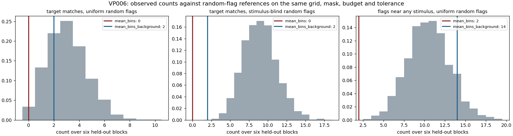

# EEG state-change detection: finding signal in noise

**The final model is 84 numbers and a logistic regression. Everything we added on top of it
lost, except one parameter. We know the signal is real because we built two null
distributions that could have said otherwise, and on the second problem they did.**

This folder is the EEG evidence behind MemoryPalace and our entry for the VoloRidge
public-data challenge. It is organised around the four things VoloRidge said they judge:
how you handle the data, how you extract signal from noise, **how elegant the result is
rather than how complex**, and how you validate.

Everything below is reproducible from the committed models with one command.

---

## The data

[Shin et al. 2018, dataset A](https://doc.ml.tu-berlin.de/simultaneous_EEG_NIRS/)
([Scientific Data](https://doi.org/10.1038/sdata.2018.3)), an open EEG/NIRS corpus.

| | |
|---|---|
| Signal | 28 EEG channels + 2 eye channels, 1000 Hz, analysed at 200 Hz |
| Task | n-back working memory, 0-/2-/3-back, nine blocks per session |
| Used here | VP002 to VP006, three sessions each = 15 sessions |
| Ground truth | The experimenters' own block and stimulus markers, never recoded |
| Licence | Public, citable, redistributed by the authors |

A session is nine task blocks of about 44 s separated by rest. The detector's job is to
mark the task periods without being told where they are. Recordings are not committed, at
about 120 MB per participant: `scripts/fetch_shin.py --subject 2` downloads one and
verifies every file against the archive's CRC.

---

## 1. Extracting the signal

Scalp EEG is microvolts of cortical activity buried under eye movement, muscle and drift.
The entire extraction is four steps:

```text
28 channels, 200 Hz
  → regress out the two eye channels          (fitted on a pre-task segment, then frozen)
  → log power in theta / alpha / beta          (2 s windows, every 0.25 s → 84 numbers)
  → logistic regression, task vs rest          (regularization chosen on whole blocks)
  → exponential moving average of the margin   (one parameter: the half-life)
  → margin ≥ 0 for 3 s becomes an interval
```

No deep learning, no spatial filter bank, no hand-tuned thresholds. Band power works
because the thing being detected is a *sustained state*, and sustained states are exactly
what second-scale band power measures.

---

## 2. Elegance: everything more complex lost

We did not start simple and stop there. We tested seven more complex alternatives, each as
a **paired comparison on the same recordings, the same windows and the same calibration
folds**. Every one lost or tied.

| Added on top of band power | Extra complexity | Paired result, same recordings | Kept |
|---|---|---|:--:|
| Riemannian covariance + tangent space | 1218 features vs 84 | Balanced accuracy 55–76% vs 81–84%. Recovered more whole tasks but flagged 22.2 s of rest against 2.0 s. | ✗ |
| EWMA volatility features | 3× the feature count | AUROC 0.856 vs 0.800, but balanced accuracy 0.672 vs 0.685 and no more whole tasks recovered | ✗ |
| Broad-band Fourier power | different estimator | Balanced accuracy 0.629 vs 0.635. A tie, for more machinery. | ✗ |
| 26 one-Hz Fourier bins | 728 features vs 84 | Balanced accuracy 0.541 vs 0.635 | ✗ |
| Bayesian dynamic linear model, AR(1) noise | latent state + noise model | Balanced accuracy 0.739 vs 0.791 for a plain moving average | ✗ |
| Adaptive IMM switching DLM | two regimes + mixing | 0.781 vs 0.791 for a plain moving average | ✗ |
| Zigzag persistent homology | 108 topological descriptors | 6 of 36 events, p = 0.13 against randomly placed flags | ✗ |
| **Exponential moving average** | **one parameter** | **7 of 9 whole tasks recovered vs 3 of 9, classifier weights held byte-identical** | **✓** |

Rows are different participants, so this is deliberately **not** a leaderboard. Comparing a
score from one participant against another would not isolate an algorithm. Each row is only
valid against its own baseline, and that is how we read it.

The one addition that survived is a single smoothing parameter, and even that is a tradeoff
we state rather than hide: it recovers more complete intervals and rejects rest slightly
worse. Every rejected alternative keeps its full numbers in
[`RESEARCH_LOG.md`](RESEARCH_LOG.md).

---

## 3. How we validate

**A null for each question, matched to the evaluation rules.**

*Circular time-shift null, for sustained detection.* The intact out-of-sample score trace is
shifted against the labels 2000 times per session. Shifting preserves autocorrelation;
shuffling destroys it. Overlapping EEG windows are not independent samples, so a
shuffle-based p-value would be fiction. The resulting null intervals reach 0.8 AUROC,
because a task period covers most of an excerpt. We report that width rather than quietly
using a test that would have flattered us.

*Random-flag null, for brief events.* Flags thrown at random on the same valid grid, under
the same budget of five per block, the same 1.5 s separation and the same ±0.5 s matching
tolerance the detector had to obey. Chance is not zero here: five random flags match about
3 of 36 events.

**A control we ran against ourselves.** The identical pipeline on the two eye channels
alone, which carry no cortical signal. On two participants the eyes come close, so part of
that signal may be ocular even after eye regression. On VP005 the detector clears the
control by 0.33. Both columns are published.

**Frozen before scoring.** Protocols written in advance and committed; models saved and
SHA-256 hashed before any held-out block is touched; fitted state verified unchanged after
inference; held-out blocks checked against every model's training hashes; no-future-leakage
tests on the temporal recursion.

**A holdout consumed exactly once.** When we suspected the brief-event detector was failing
because it never saw background windows during training, we wrote the fix *and its adoption
rule* into [`background_negatives_protocol.md`](background_negatives_protocol.md), froze it,
and ran it once on VP006, a participant no analysis had touched. It moved 0 of 36 to 2 of
36, p = 0.83 against the null. The prespecified rule failed, so **nothing was adopted**. The
protocol, the run and the refusal are all committed.

---

## 4. How we handle the data

| Risk | What we did |
|---|---|
| Leakage through neighbouring windows | Regularization chosen over **whole calibration blocks**, never shuffled windows |
| Leakage through time | Per session, the first six blocks calibrate and the last three are scored. Nothing fitted after seeing a test score. |
| Silent model drift | Model files and in-memory state hashed before and after every inference pass |
| Quiet data loss | Artifact-rejected windows stay missing and break intervals, rather than being bridged |
| Cross-contamination | Weights never cross a session or a person |
| Moving the goalposts | Adoption rules written into the protocol before the run |

---

## Results


Blue is the EEG detector out of sample. Grey bars are the 95% interval of what a random
alignment of that same trace scores. Orange diamonds are eye channels only.

| Participant | Mean AUROC | Per session | Sessions at p ≤ 0.05 | Whole tasks recovered | Rest wrongly included | Eyes only |
|---|---:|---|---:|---:|---:|---:|
| VP002 | 0.925 | 0.904 / 0.898 / 0.972 | 3/3 | 7/9 | 5.4 of 72 s | 0.883 |
| VP003 | 0.800 | 0.716 / 0.930 / 0.754 | 1/3 | 5/9 | 4.9 of 72 s | 0.848 |
| VP004 | 0.652 | 0.809 / 0.605 / 0.543 | 1/3 | 0/9 | 13.9 of 72 s | 0.522 |
| VP005 | 0.888 | 0.726 / 1.000 / 0.938 | 2/3 | 2/9 | 5.2 of 72 s | 0.559 |
| VP006 | 0.669 | 0.658 / 0.480 / 0.871 | 1/3 | 6/9 | 28.0 of 72 s | not run |

**8 of 15 sessions beat the null at p ≤ 0.05**, and 14 of 15 sit above chance. Every number
was recomputed from the saved models and equals the value in each original experiment's
report.


The strongest participant. Grey traces are calibration blocks (in sample), blue traces are
the scored blocks (out of sample), split by the divider. Shaded spans are the true task
periods, hatched spans the labeled rest, bars at the top are the intervals the detector
returned.


The weakest participant, shown on purpose. The margin stays positive through most of each
excerpt, so returned intervals cover the task *and* much of the rest. Whole-task matches
come cheaply here while 39% of labeled rest is wrongly included.

### The negative result, which we find more useful

Brief evoked events are not detectable by any of five methods on four participants.


| Detector | Participant | Events matched | Random mean [95%] | p(random ≥ observed) |
|---|---|---:|---:|---:|
| Mean-amplitude bins | VP001 | 4/36 | 3.00 [0, 6] | 0.35 |
| xDAWN covariance | VP001 | 6/36 | 3.00 [0, 6] | 0.07 |
| Mean-amplitude bins | VP002 | 3/36 | 3.15 [0, 6] | 0.63 |
| Mean-amplitude bins | VP005 | 2/36 | 3.63 [1, 7] | 0.90 |
| **Zigzag persistent homology** | VP005 | **6/36** | 3.63 [1, 7] | **0.13** |
| Combined | VP005 | 3/36 | 3.63 [1, 7] | 0.72 |

The zigzag row is the point. Six matches against a two-match baseline reads as a threefold
improvement, and it sits inside the range of randomly thrown darts. **Without the null we
would have shipped it as a result.**



That finding decided the product: MemoryPalace captures forward on a persistence filter,
because sustained states survived the analysis and instantaneous spikes did not.

---

## Reproduce

Python 3.11+, from this folder:

```bash
python -m venv .venv && .venv/bin/pip install -e '.[test,real]'
.venv/bin/python -m pytest -q                      # 79 tests
.venv/bin/python scripts/fetch_shin.py --subject 2 --out data/shin2018/VP002
.venv/bin/python -m eeg_moments backtest --out outputs/backtest_state_reproduction
```

`backtest` needs VP002 to VP006 on disk. It rescans them with the saved models under
`outputs/`, regenerates every figure and recomputes the null in about five minutes. Every
other experiment has its own command in [`RESEARCH_LOG.md`](RESEARCH_LOG.md).

| Path | What |
|---|---|
| `outputs/backtest_state/` | Walk-forward figures, time-shift null, `RESULTS.md`, `INTERPRETATION.md` |
| `outputs/burst_diagnostic_dev/` | Random-flag null for brief events |
| `outputs/background_vp006/` | The frozen protocol, its single run, and its refusal |
| `outputs/*/INTERPRETATION.md` | One page per experiment: what was decided and why |
| `eeg_moments/` | Loader, features, models, smoothing, benchmarks, diagnostics |
| `*_protocol.md` | Protocols written *before* each fresh-participant run |
| `RESEARCH_LOG.md` | Full chronological log, every command and every number |

---

## Limits, stated up front

- **The label is task versus rest**, a proxy for a cognitive state change. Not confusion,
  not insight, not focus, and we never call it that.
- **Ocular contribution is not isolated** on VP002 and VP003, where the eye-only control
  reaches 0.88 and 0.85.
- **Two of five participants are weak.** VP004 averages 0.652 and VP006 0.669; on VP006 the
  detector flags 28 of 72 seconds of labeled rest, so those intervals are not usable as-is.
- **72 seconds of labeled rest per participant** cannot support a false-alarm rate per hour.
- **Weights are session-specific** and transfer to nobody.
- **These are public participants**, unrelated to anyone filmed by the phone in the demo. A
  shared playback clock is a presentation convention, never physiological synchronisation.
