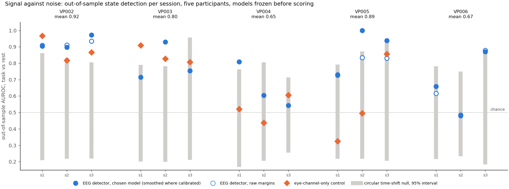
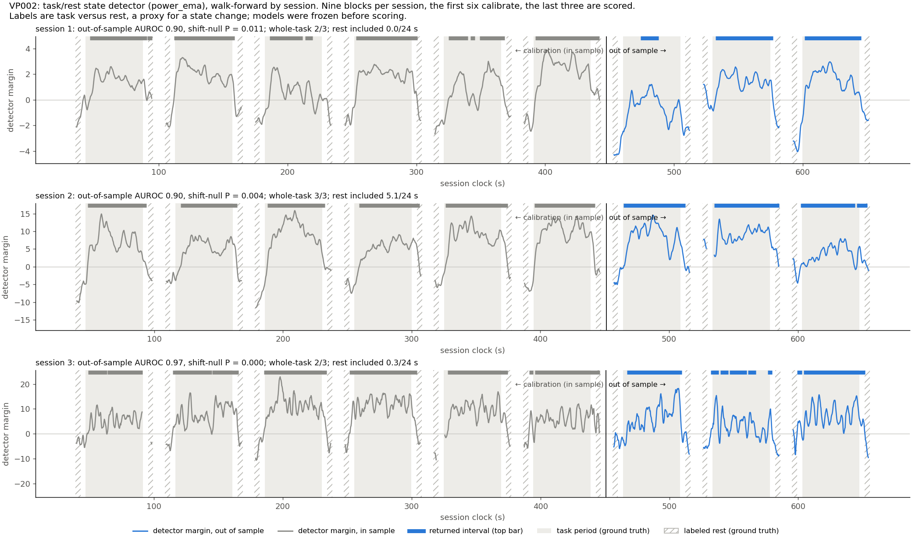
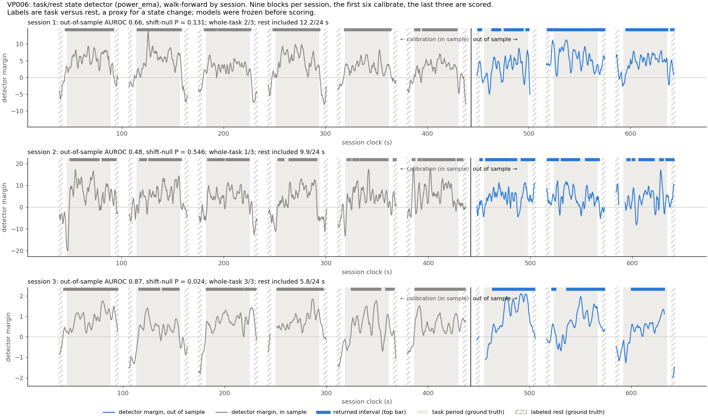
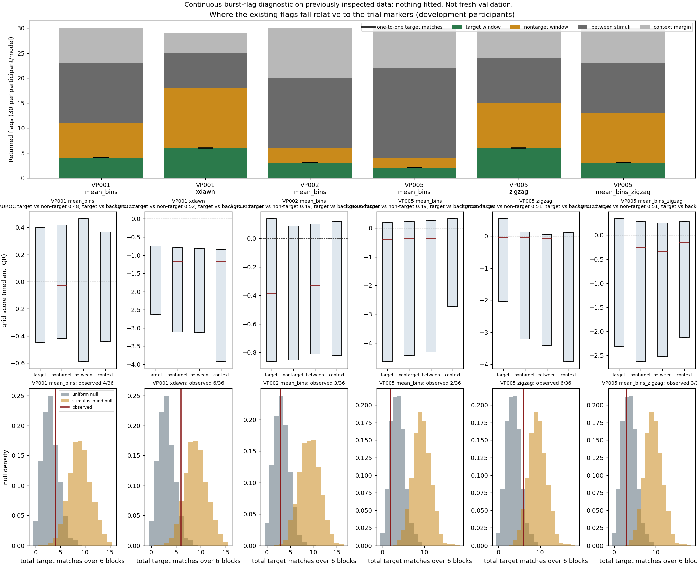

# EEG state-change detection: finding signal in noise

This folder is the EEG side of MemoryPalace: a session-calibrated detector of **task engagement versus rest** in scalp EEG, evaluated walk-forward on public data with models frozen before scoring, plus the full record of what did not work. Everything here can be rerun from the saved models.

**One-line result.** On five participants the detector separates task from rest out of sample with mean AUROC 0.65 to 0.93, and 8 of 15 sessions beat a time-shift null at p ≤ 0.05. Brief "burst" events could not be detected above chance, and the record shows that too.

## The data

- [Shin et al. 2018, dataset A](https://doc.ml.tu-berlin.de/simultaneous_EEG_NIRS/) ([paper](https://doi.org/10.1038/sdata.2018.3)): 28 EEG channels plus 2 eye channels at 1000 Hz, analysed at 200 Hz, while participants perform 0-, 2- and 3-back working-memory tasks. Public, with markers for every task block and stimulus.
- Participants VP002 to VP006, three sessions each. A session has nine task blocks of about 44 s separated by rest. Ground truth is the experiment's own block markers; labeled rest is the 4 s before and after each task.
- The recordings are not in the repo (about 120 MB per participant). `python scripts/fetch_shin.py --subject 2` downloads and CRC-checks one participant.

## The approach

1. **Preprocess.** Resample to 200 Hz, regress out the eye channels with coefficients fitted on a separate pre-task segment and then frozen, reject artifact windows with fixed amplitude and step limits.
2. **Features.** Log band power in theta (4 to 8 Hz), alpha (8 to 13 Hz) and beta (13 to 30 Hz) on 2 s windows over 28 channels: 84 numbers every 0.25 s.
3. **Classifier.** Standardized, class-balanced logistic regression, task versus rest. Regularization is chosen by cross-validation over whole calibration blocks, never over shuffled neighbouring windows.
4. **Smoothing.** A causal exponential moving average of the classifier margin, half-life chosen on calibration blocks only. A margin at or above zero for at least 3 s becomes a returned interval.
5. **Walk-forward.** In every session the first six blocks calibrate and the last three are scored. Models are saved and hashed before scoring, and nothing is changed afterwards. Weights never transfer between sessions or people.
6. **Two benchmarks.** A **circular time-shift null**: the intact out-of-sample score trace is shifted against the labels 2000 times, which preserves autocorrelation, and the observed AUROC is read against that distribution. An **eye-channel-only control**: the same pipeline run on the two EOG channels alone, to show how much of the signal could be eye movement rather than brain.

## Results



Blue is the EEG detector out of sample. Grey bars are the 95% interval of what a random alignment of that same trace scores; they are wide because a task period covers most of an excerpt, which is exactly why the per-session probability matters more than the raw AUROC. Orange diamonds are eyes only.

| Participant | Model | Out-of-sample AUROC, mean | Sessions beating the null | Whole-task intervals recovered | Rest wrongly included | Eye-only control |
|---|---|---:|---:|---:|---:|---:|
| VP002 | band power + EMA | 0.925 | 3/3 | 7/9 | 5.4 of 72 s | 0.883 |
| VP003 | band power | 0.800 | 1/3 | 5/9 | 4.9 of 72 s | 0.848 |
| VP004 | band power | 0.652 | 1/3 | 0/9 | 13.9 of 72 s | 0.522 |
| VP005 | band power + EMA | 0.888 | 2/3 | 2/9 | 5.2 of 72 s | 0.559 |
| VP006 | band power + EMA | 0.669 | 1/3 | 6/9 | 28.0 of 72 s | not run |

Every number was recomputed from the saved models and equals the value in each original experiment's report. The signal is real, session-specific and variable across people. On VP002 and VP003 the eyes alone score nearly as well as the EEG, so part of that signal may be ocular even after eye regression; on VP005 the EEG detector is far above the eye control.



The strongest participant. Grey traces are the calibration blocks (in sample), blue traces are the scored blocks (out of sample). Shaded spans are the true task periods, hatched spans the labeled rest, bars at the top the returned intervals.



The weakest participant, shown on purpose: the margin stays positive through most of each excerpt, so returned intervals cover the task and much of the rest. Whole-task matches come cheaply here (6/9) while 39% of labeled rest is wrongly included.

## What did not work, and how we know

- **Brief events (bursts).** Five detectors for stimulus-locked responses (mean-amplitude bins, xDAWN covariance, zigzag persistent homology, combinations, and a version trained with background negatives on an untouched participant under a frozen protocol) all retrieved n-back target onsets no better than randomly placed flags under the same grid, budget and tolerance. `outputs/burst_diagnostic_dev/INTERPRETATION.md` and `outputs/background_vp006/INTERPRETATION.md` hold the random-flag nulls that established this.
- **Fewer channels.** Restricting to midline channels, fixed P300 amplitudes, or a wider filter band did not create a usable single-trial signal (`outputs/channel_check_dev/INTERPRETATION.md`).
- **Fancier state models.** EWMA volatility features, Fourier bins, Bayesian dynamic linear models and an adaptive variant did not beat simple band power plus smoothing on fresh participants (`RESEARCH_LOG.md`).



## Reproduce

Python 3.11+, then from this folder:

```bash
python -m venv .venv && .venv/bin/pip install -e '.[test,real]'
.venv/bin/python -m pytest -q                      # 79 tests
.venv/bin/python scripts/fetch_shin.py --subject 2 --out data/shin2018/VP002
.venv/bin/python -m eeg_moments backtest --out outputs/backtest_state_reproduction
```

`backtest` needs the recordings of VP002 to VP006 on disk; it rescans them with the saved models under `outputs/` and regenerates the figures and the null in about five minutes. Every other experiment has its own command in `RESEARCH_LOG.md`.

## Where to look

| Path | What |
|---|---|
| `outputs/backtest_state/` | Presentation figures, `RESULTS.md`, `INTERPRETATION.md`, `report.json` |
| `outputs/*/INTERPRETATION.md` | One page per experiment: what was decided and why |
| `eeg_moments/` | The package: loader, features, models, smoothing, benchmarks, diagnostics |
| `*_protocol.md` | Protocols written before each fresh-participant run |
| `RESEARCH_LOG.md` | The full chronological research log with every command and number |
| `LLM_HANDOFF.md`, `session_pipeline.md` | Continuation record and product design |

## Limits, stated up front

Labels are task versus rest, a proxy for a cognitive state change, not "focus". One session's weights never transfer to another. Rest totals 72 s per participant, too little for an hourly false-alarm rate. Eye, muscle and sensory contributions are not isolated. The recordings are public participants, not anyone filmed with a phone.
