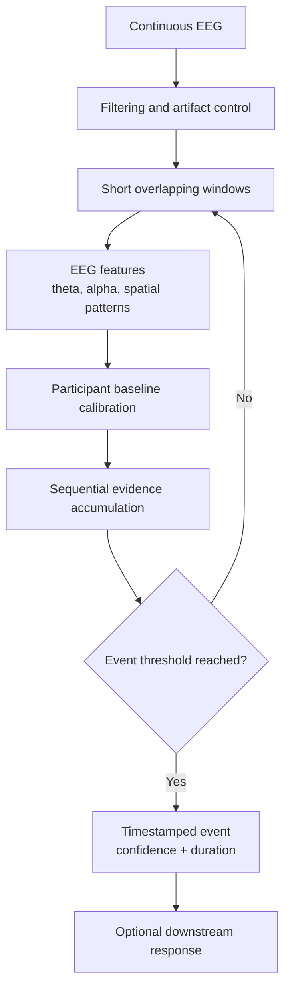
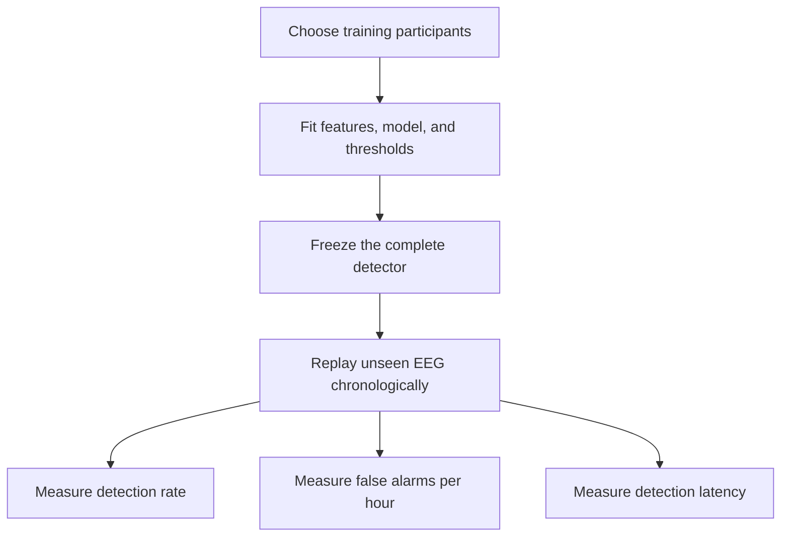

# Detecting Neural Spike-Like Events Associated with Cognitive Load

**Proposed venue:** *IEEE Transactions on Human-Machine Systems*
**Proposed format:** Technical Correspondence, maximum 5 IEEE two-column pages

## Project Idea:

**The system monitors continuous EEG and detects an unusual neural event associated with a change in cognitive demand. When an event is detected, it emits a timestamped trigger with a confidence score.**

That trigger could later be used to slow or rewind a lecture, save the surrounding 30 seconds, or activate another assistive response. Those applications are examples only; this study focuses on reliable event detection.

Directly decoding the meaning of EEG is highly person-specific: even when different people perform the same mental task (for example, thinking about the same word), their EEG signatures can vary because of physiology, electrode placement, attention, and strategy. Such systems often need substantial per-person calibration. This project instead asks whether a **relative neural event** - a spike-like change from a person's recent baseline - can be detected more person-agnostically, with little or no individual retraining. That hypothesis motivates the research question below.

## Research question

> **Can a device-independent EEG algorithm detect neural spike-like events associated with sudden changes in cognitive load using few electrodes, while maintaining a practical false-alarm rate for unseen people and datasets?**
>
> **OR**
>
> **Can an uncertainty-aware EEG detector generate reliable, low-interruption cognitive-overload triggers for adaptive human–machine interfaces using a small number of electrodes?**

### What “neural spike” means here

The original idea is to detect a **neural spike**. Scientifically, a single raw EEG spike is ambiguous: it may be an eye blink, muscle artifact, epileptiform activity, or another transient. Cognitive load is more commonly reflected by changes in EEG patterns over short intervals.

Therefore, this project defines the target as a **spike-like event in an estimated cognitive-load score**, not a single-neuron action potential or a clinical EEG spike. The system still produces the intended discrete output: **event detected at time _t_**.

## Proposed pipeline

## Preliminary work completed

An end-to-end prototype has already been implemented for loading EEG, selecting electrodes, extracting window-level features, training a detector, and evaluating unseen participants. Early tests use a public 33-participant, 16-channel OpenBCI dataset containing annotated surprise events. This dataset validates the pipeline mechanics, but surprise events are only a proxy—not proof of cognitive-load detection.

### Event-recognition effectiveness by electrode configuration

| Sensor-style configuration        |                Electrodes used | Recognition effectiveness (AUROC) | Above chance |
| --------------------------------- | -----------------------------: | --------------------------------: | -----------: |
| Full OpenBCI montage              |                    16 channels |                   **77.8%** | +27.8 points |
| Crown-like layout                 | F3, F4, C3, C4, P3, P4, O1, O2 |                   **76.3%** | +26.3 points |
| Best two-electrode pair           |                         Cz, O1 |                   **74.5%** | +24.5 points |
| Four-channel frontocentral layout |                 Fz, Cz, F7, F8 |                   **71.9%** | +21.9 points |
| Muse-like layout                  |               Fp1, Fp2, T7, T8 |                   **68.0%** | +18.0 points |
| Two-electrode glasses layout      |                         F7, F8 |                   **60.1%** | +10.1 points |

**How to read this table:** AUROC measures ranking quality; 50% is chance and 100% is perfect. These are electrode subsets from the **same 16-channel recording**, not head-to-head tests of commercial headsets. The result suggests electrode efficiency: an eight-electrode layout retained most of the 16-channel performance, while the best two-electrode pair lost only 3.3 AUROC points.

Under the stricter leave-one-participant-out test, the full 16-channel model reached **74.7% AUROC** and **65.4% balanced accuracy**. Shuffled-label and pre-event controls remained near **50%**, supporting that the model uses event-related information rather than an obvious evaluation artifact.

### Early continuous-detection evaluation

| Evaluation                       |                     Early result | Interpretation                                |
| -------------------------------- | -------------------------------: | --------------------------------------------- |
| Continuous replay detection rate |                   **1.5%** | Current thresholding misses most events       |
| Continuous replay false alarms   |              **29.2/hour** | Not yet suitable for deployment               |
| Mean latency when detected       |                  **1.1 s** | Fast, but measured on few detections          |
| Overlap simulation: 75% overlap  | **30.3 false alarms/hour** | Overlapping windows amplify repeated evidence |
| Overlap simulation: no overlap   |  **1.3 false alarms/hour** | A 24× reduction in the controlled simulation |

These are **early evaluation results**, not final performance claims. They show that the feature/classification pipeline is promising and electrode-efficient, while continuous event logic and false-alarm control are the main unsolved research problems.

The 77.8% AUROC and 1.5% continuous detection rate are not contradictory: the first measures window-ranking quality, while the second tests whether the current thresholding logic turns those scores into correctly timed events.

## Proposed contribution

1. A calibrated sequential detector that converts EEG workload scores into discrete neural-event triggers.
2. Evaluation with event-level metrics: detection rate, false alarms per hour, and detection latency.
3. Validation on unseen participants and, where possible, unseen sessions, tasks, and datasets.
4. Electrode-ablation analysis showing the accuracy–sensor-count tradeoff.
5. A device-independent trigger interface; the downstream application remains out of scope.

## Public-dataset plan

| Dataset                                                       | Why it is useful                                                                                                                           |
| ------------------------------------------------------------- | ------------------------------------------------------------------------------------------------------------------------------------------ |
| [COG-BCI](https://www.nature.com/articles/s41597-022-01898-y)  | 29 participants, three sessions, four cognitive tasks, and more than 100 hours of open EEG; useful for cross-session and cross-task tests. |
| [NEMAR/OpenNeuro ds007262](https://nemar.org/dataset/on007262) | 18 participants, 19 EEG channels, eight workload levels, and event annotations; closest fit for cognitive-load event detection.            |
| [OpenNeuro ds003838](https://openneuro.org/datasets/ds003838)  | Larger optional confirmation dataset with 64-channel EEG and multiple workload levels.                                                     |

The first two datasets are sufficient for the initial paper. One dataset can be used for development and the other for external validation, with all thresholds frozen before the external test.

## Evaluation plan

The proposed detector will be compared with a fixed threshold, persistence rules, and a standard cumulative-change detector. All preprocessing, calibration, and thresholds will be learned from training data only.

## Claims and boundaries

- This is an offline chronological evaluation of an online-capable method; it is not a live-headset user study.
- Public datasets are sufficient for an algorithm and evaluation contribution if the validation is rigorous.
- The model detects an EEG-derived event associated with cognitive demand; it does not read thoughts or diagnose a medical condition.
- Lecture control and other interventions are motivating applications, not evaluated outcomes.

## Submission target and cost

The best-sized submission is a **Technical Correspondence** to *IEEE Transactions on Human-Machine Systems*. The journal allows up to **5 IEEE two-column pages** for this format. Under the traditional publication route, **no open-access payment is required**; voluntary page charges are not a publication requirement. Mandatory overlength charges apply beyond five pages, so the manuscript should remain within the limit. Current rules should be reconfirmed before submission in the journal's [official author instructions](https://www.ieeesmc.org/publications/transactions-on-human-machine-systems/information-for-authors-2/).

## Immediate next steps

1. Define event labels and matching tolerance for cognitive-load transitions.
2. Run the frozen pipeline on NEMAR/OpenNeuro ds007262.
3. Reduce false alarms using refractory periods and non-overlapping evidence updates.
4. Validate across COG-BCI sessions and tasks.
5. Draft the five-page paper around the algorithm, electrode tradeoff, and event-level evaluation.
